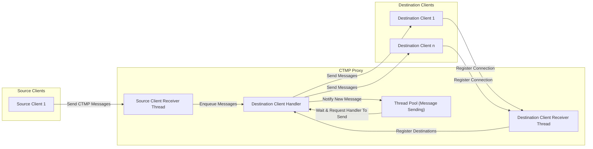

# CTMP Proxy

This is my submission for the CoreTech Operation Wire Storm. 
In order to meet the specification, I focused on speed and 
maintainability, especially in scale. My design featured one 
thread each for receiving destination and source clients, and a thread pool for sending messages.

## Table of Contents
- [Quick Setup](#quick-setup)
- [Custom Setup](#custom-setup)
- [Architecture Structure](#architecture-structure)
- [Project Structure](#project-structure)
- [Testing](#testing)
- [Improvements and Limitations](#improvements-and-limitations)

## Quick Setup

1. Clone the repo
```bash
git clone https://github.com/NotDari/Coretech-Operation-Wire-Storm
cd Coretech-Operation-Wire-Storm/
```
2. Create a build folder and make
```bash
mkdir build && cd build
cmake ..
make
```
3. Run the proxy
```bash
./operation_wire_storm
```

## Custom setup

In order to account for increasing workloads, and to improve
customisation a collection of implementable flags have been added.

- Debug mode:
```bash
 ./operation_wire_storm -db
 # Allows debug comments to be outputted
```
- Set the destination port:
```bash
 ./operation_wire_storm --dp 66666 # Default: 44444
 # Sets 66666 as the destination port
```

- Set the source port:
```bash
 ./operation_wire_storm --sp 12345 # Default: 33333
 # Sets 12345 as the source port
```
- Set the Thread Count:
```bash
 ./operation_wire_storm -tc 5 # Default: 4
 # Sets the size of the sending messages thread pool to 5
```

- Set the Destination Client Backlog queue:
```bash
 ./operation_wire_storm -mc 20 # Default: 10
 # Sets max number of destination Clients to have in the queue as 20
```

## Architecture Structure

The diagram illustrates how the proxy handles the source and destination clients,
as well as the flow of messages between them.



## Project Structure
```
.
├── Clients #Implementations of clients
│   ├── Receivers
│   │   ├── ClientReceiver.cpp
│   │   ├── ClientReceiver.h
│   │   ├── DestinationClientReceiver.cpp
│   │   ├── DestinationClientReceiver.h
│   │   ├── SourceClientReceiver.cpp
│   │   └── SourceClientReceiver.h
│   ├── Client.h         
│   ├── DestinationClient.cpp
│   ├── DestinationClient.h
│   ├── SourceClient.cpp
│   └── SourceClient.h
├── Handlers #Message routing
│   ├── DestinationClientHandler.cpp          
│   ├── DestinationClientHandler.h
│   ├── ThreadPool.cpp
│   └── ThreadPool.h    
├── Network #Server and Protocols
│   ├── Protocols
│   │   ├── CTMP.cpp
│   │   └── CTMP.h
│   ├── Server.cpp          
│   └── Server.h
├── Tests #Python testing
│   ├── buffers.py          
│   ├── client.py
│   └── tests.py
├── Utils #Helper functions
│   ├── DefaultConfig.h          
│   ├── ErrorCode.h
│   ├── Expected.h
│   ├── Logger.cpp
│   └── Logger.h
├── CMakeLists.txt
├── main.cpp
└── README.md
```

## Testing

These tests do not need any additional libraries. 
Do not alter the default ports if using these tests.

1. Make sure the proxy is running
```bash 
./operation_wire_storm
```
2. Go to the tests folder(From the root project folder)
```bash
cd Tests
```
3.Run the tests
```bash
python3 tests.py
```

## Improvements and Limitations

### Future Potential Improvements
- Instead of logging to the console, create a log file 
with a dedicated logging thread
- Instead of having the user manually set the thread count,
have a dynamic thread pool


### Limitations
- Due to destination clients connecting and disconnecting,
since messages are only added to currently connected clients,
some clients could miss messages, though not an issue as of the
competition specification
- The python tests in the current implementation can be affected by 
device specifications (e.g. Resource exhaustion) if trying to test a large number of threads


